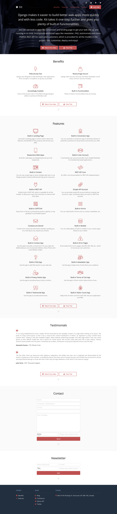
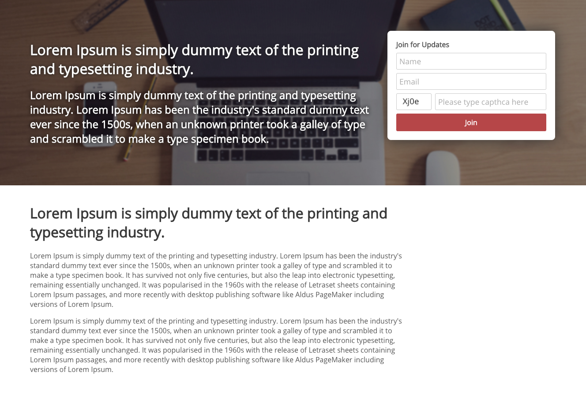
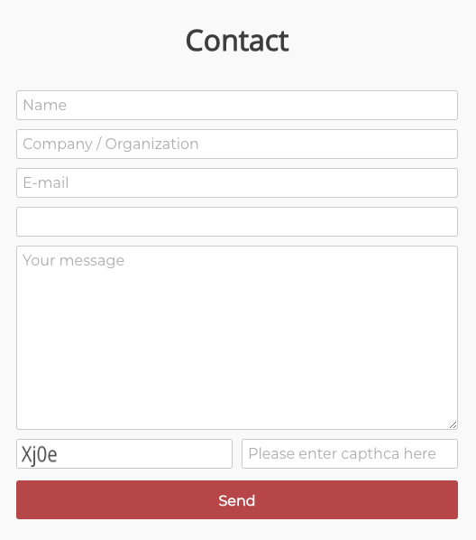

# Kit

Kit is a Django project that provides built-in apps and REST API. It also offers several kinds of built-in web
sites as well, like conversion and landing page.

It is intend to give you a **kit** of models, tools and utilities if you will, so you can have your service
(landing page, conversion page, REST API, etc.) up and running in no time. You can customize every aspect of it as you
can imagine.   


# Features

- [User Account with Email Based Authentication](#user-account-with-email-based-authentication)
- [Web Sites](#web-sites)
- [Forms and CSRF](#forms-and-csrf)
- [Apps](#apps)
- [REST API](#rest-api)
- [Core REST API](#core-rest-api)
- [Core Functionalities](#core-functionalities)
- [SASS for CSS ans Static Files](#sass-for-css-ans-static-files)
- [Doxygen Documentation](#doxygen-documentation)
- [Setup](#setup)
- [Road Map](#road-map)


# User Account with Email Based Authentication

Kit uses email based user authentication, which is built on Django's `AbstractBaseUser` class, so users use their email
addresses to log-in.


# Web Sites

Kit offers conversion (lean startup) page and landing page via its [conversion](kit_doc/CONVERSION.md) and
[landingPage](kit_doc/LANDING_PAGE.md) apps respectively. So you can get both sites running in no time. These sites
have built-in captcha feature for their forms. 

**Landing Page Example**



**Conversion Web Page Example**




# Forms and CSRF

The web sites provided with the project contain forms such as contact and newsletter subscription. I have built a
captcha system based on Django's CSRF protection system in order to prevent automated spams. 

I use JavaScript to render a captcha code on a canvas in the forms. This code is portion of the token obtained from 
rendered hidden `csrfmiddlewaretoken` input. This token is provided by Django so it is very easy to check it on
the server side.

The forms have a `captcha` input, which is there to send the captcha to the server, even though they are not required by
the models which the forms use.

Visitor enters the captcha code into `captcha` input he/she sees on the canvas and submits the form. Upon receiving the
request, the view uses `Form.is_valid` method, which triggers `Form.clean_capthca` method that I implemented. If the
captcha doesn't match pre-determined portion of the `csrf` token provided previously, the submission fails and the 
visitor is asked to confirm the captcha. 

For this to work the way we want, we have to renew the `csrf` token every time we receive a `GET` method for the page.
We do that by invoking `django.middleware.csrf.rotate_token` function in the view where applicable.  

Rendered form looks like the one below.



**PLEASE NOTE:** You must edit the following email settings in `projectSettings.common` module since forms send email
upon successful submissions.

- `EMAIL_USE_TLS`
- `EMAIL_PORT`
- `EMAIL_HOST`
- `EMAIL_HOST_USER`
- `DEFAULT_FROM_EMAIL`
- `SERVER_EMAIL`
- `EMAIL_HOST_PASSWORD`


# Apps

| App                                                           | Description                                                   |
| :------------------------------------------------------------ | :----------------------------------------------------         |
| [commonStatic](kit_doc/COMMON_STATIC.md)                      | App for serving common static files, like css, js, etc.       |
| [contact](kit_doc/CONTACT.md)                                 | Contact, address, email, phone, social media                  |
| [content](kit_doc/CONTENT.md)                                 | Content and items                                             |
| [conversion](kit_doc/CONVERSION.md)                           | Conversion web site                                           |
| [core](kit_doc/CORE.md)                                       | Core functionalities and utilities                            |
| [errorPage](kit_doc/ERROR_PAGE.md)                            | Renders error pages like 400, 404, etc.                       |
| [faq](kit_doc/FAQ.md)                                         | Frequently Asked Questions                                    |
| [landingPage](kit_doc/LANDING_PAGE.md)                        | Landing page                                                  |
| [language](kit_doc/LANGUAGE.md)                               | Language model, provides language option to models            |
| [newsletter](kit_doc/NEWSLETTER.md)                           | Newsletter/subscribers related app                            |
| [privacyNotice](kit_doc/PRIVACY_NOTICE.md)                    | Privacy Notice                                                |
| [projectSettings](kit_doc/PROJECT_SETTINGS.md)                | Project settings, production, development, etc.               |
| [restAPICore](kit_doc/REST_API_CORE.md)                       | Core functionalities for REST API                             |
| [simpleAPIAccount](kit_doc/SIMPLE_API_ACCOUNT.md)             | Simple REST API account (doesn't require user registration)   |
| [termsOfUse](kit_doc/TERMS_OF_USE.md)                         | Terms of Use                                                  |
| [testimonial](kit_doc/TESTIMONIAL.md)                         | Testimonial related app                                       |
| [userAccount](kit_doc/USER_ACCOUNT.md)                        | E-mail based user account                                     |
| [visitorCount](kit_doc/VISITOR_COUNT.md)                      | Track user count for all URL that you project has             |


# REST API

The project provides built-in REST API for all the models it uses. Every app also has example `Postman` collections in
`<APP_NAME>/data/postman` folder. Please check [RES API](kit_doc/REST_API.md) documentation for more information.
 
 
# Core REST API

Kit REST API uses some core functionalities that I provide in [restAPICore](kit_doc/REST_API_CORE.md) app. I'll keep
updating this app for more complex functionalities. 


# Core Functionalities 

Kit provides some core functionalities via [core](kit_doc/CORE.md) app. 


# SASS for CSS and Static Files

The project uses SASS for CSS. I provided some abstract SASS logic that you can inherit and change based on your needs.
Please check `<APP_NAME>/static/<APP-NAME>/sass` folder of the apps where applicable.

Likewise provided static files live under `<APP_NANE>/static/` folder of the apps where applicable.

Please check [commonStatic](kit_doc/COMMON_STATIC.md) app for more information.


# Doxygen Documentation

Python API documentation (Generated with Doxygen) is provided. Please check `kit_doc/doxygen/html/index.html`. 


# Setup

Create a virtual environment. I use Python 3.8.2.

```shell script
virtualenv -p python3 <NAME>
```

Activate it.

```shell script
cd <NAME>;
source bin/activate;
```

Install requirements.

```shell script
pip3 install -r requirements.txt
```

Migrate.

```shell script
python manage.py makemigrations;
python manage.py migrate;
```

Create super user.

```shell script
python manage.py createsuperuser;
```

Create demo data.
 
 ```shell script
python manage.py createData kit;
```

Collect static.

```shell script
python manage.py collectstatic -i *.sass;
```

Run server.

```shell script
python manage.py runserver;
```

Enjoy!


# Roadmap

- Adding user registration and verification web pages.
- Adding user agreement app.
- REST API implementation for user account groups and permissions.
- REST API implementation of `conversion.models.Subscriber` model.
- Adding advanced features to REST API core app. 
- Adding React control panel.
